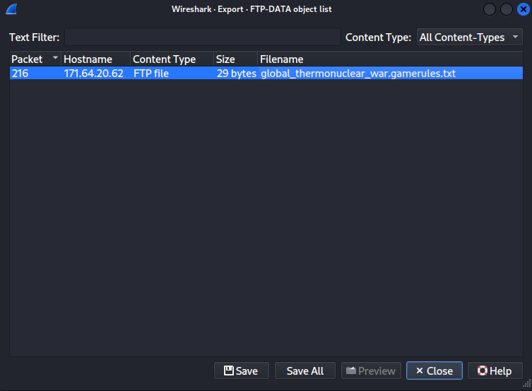
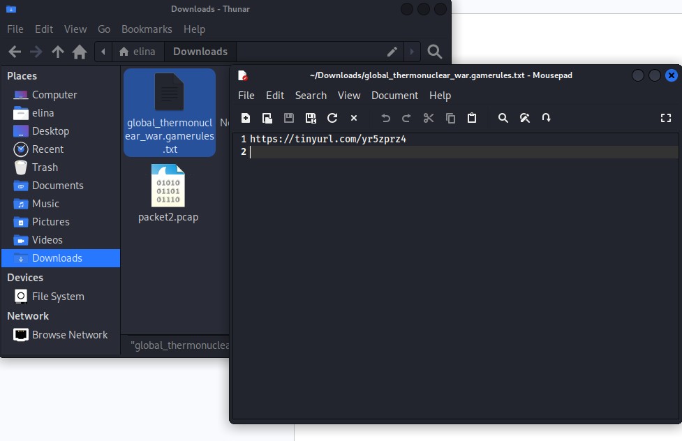
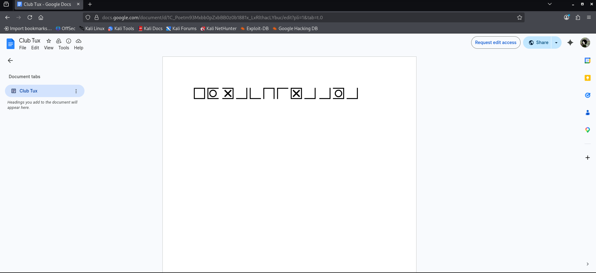
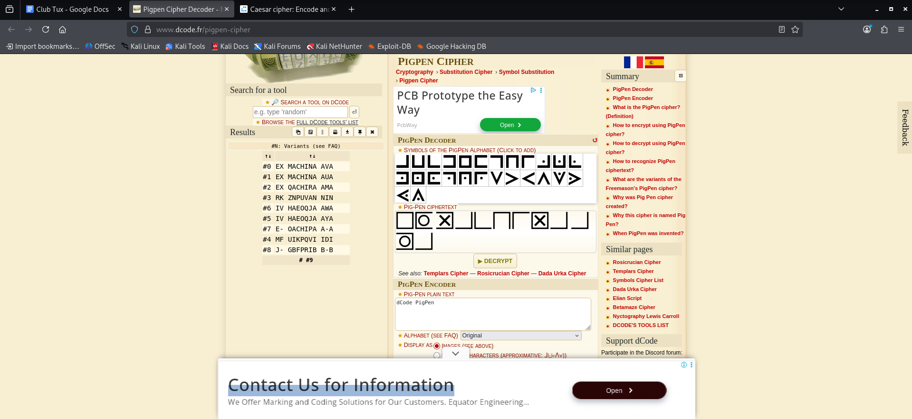
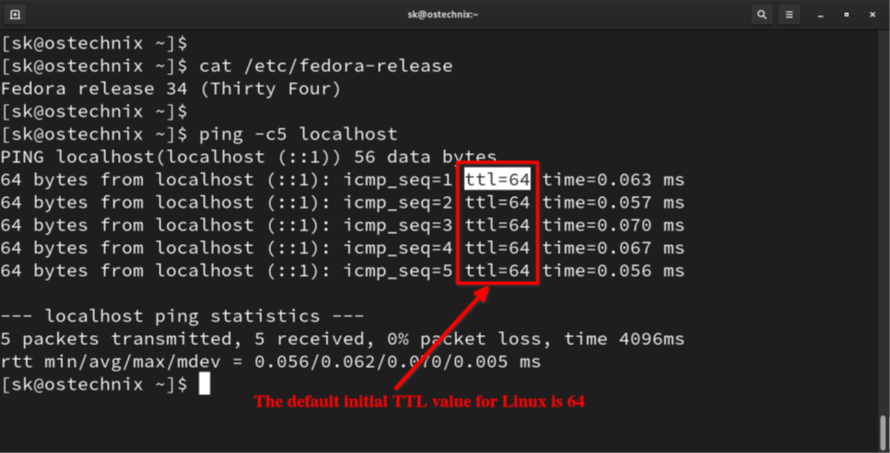
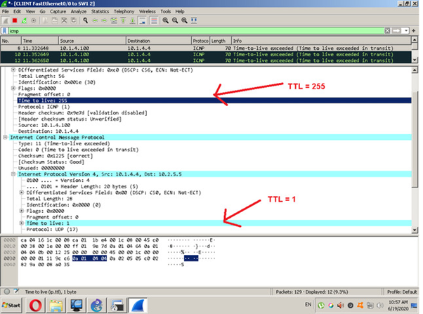
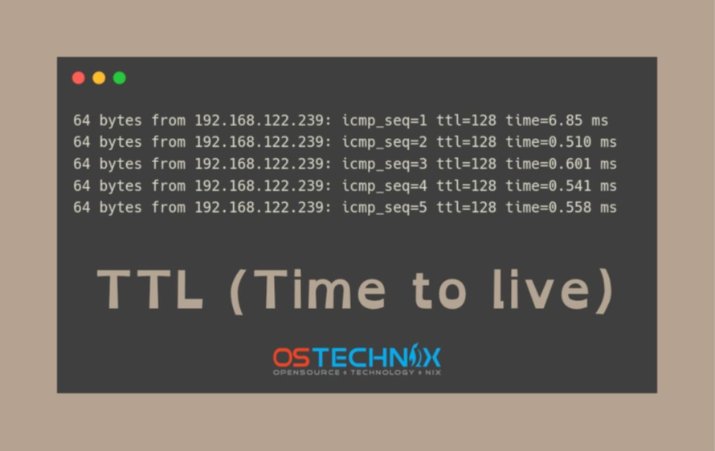
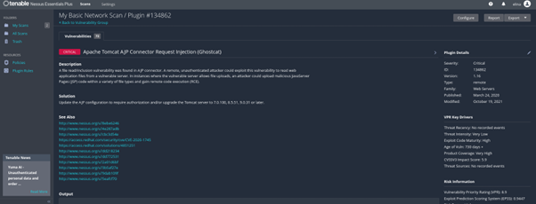
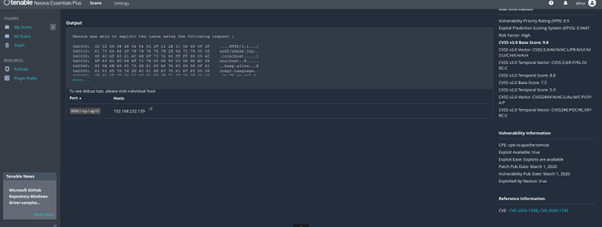

# Chapter 4: Scanning

## QUESTION 1

### Analyse packet1.pcap and find the flag.

> 1. Use the display filter and search for '{' or'7b' and found '7b' in packet 11.

 

> 2. tshark -r packet1.pcap -T fields -e data | xxd -r -p

> Noticed there is an anomalous Base64 string hidden within repetitive noise which is 'U1VDVEyyMDIze2FpX2lzX2Nvb2x9'.

 

> 3. echo "U1VDVEyyMDIze2FpX2lzX2Nvb2x9" | base64 -d

> The Base64 string was successfully decoded, revealing the hidden flag.

 

## QUESTION 2

### Analyse packet2.pcap and find the flag.

> Export FTP file.

 

> Open the file using mousepad.

> Discovered a URL.

 

> Visit the URL and discover Google Docs that contains pigpen code.

 

> Use an online pigpen decoder tool.

> Retrieve a list of possible flags, but the most logical one is "ex machina ava".

 

## QUESTION 3

### Intrepret an Nmap Output

| PORT | STATE | SERVICE | VERSION |
| :--- | :--- | :--- | :--- |
| 21/tcp | open | ftp | vsftpd 2.3.4 |
| 22/tcp | open | ssh | OpenSSH 5.3p1 |
| 80/tcp | open | http | Apache 2.2.8 |
| 139/tcp | open | netbios-ssn |
| 445/tcp | open | microsoft-ds Windows 7 Professional 7601 Service Pack 1 |

 

> 1. What can an attacker do with each port?

| No. | Port | Attacker Actions |
| :--- | :--- | :--- |
| 1. | Port 21 (FTP) | Exploiting the version’s backdoor, brute-forcing credentials, or checking for anonymous access to steal files. |
| 2. | Port 22 (SSH) | Attempting to crack passwords via brute-force or searching for exposed private keys for remote access. |
| 3. | Port 80 (HTTP) | Mapping the web structure to find vulnerabilities like SQL injection, XSS, or server-level exploits. |
| 4. | Port 139 (NetBIOS) | Enumerating host information, user lists, and master browsers to map the internal network. |
| 5. | Port 445 (SMB)| Executing unauthenticated remote code to gain system privileges and spread through the network. |

 

> 2. What vulnerabilities are likely present based on the version?

| No. | Service | Likely Vulnerability |
| :--- | :--- | :--- |
| 1. | vsftpd 2.3.4 | Famous for a backdoor triggered by a specific character sequence in the username, granting an instant root shell on port 6200.|
| 2. | Apache 2.2.8 | Highly susceptible to DoS (Slowloris) and various memory corruption flaws due to its age. |
| 3. | OpenSSH 5.3p1 | Vulnerable to username enumeration, allowing attackers to verify valid accounts before launching brute-force attacks. |
| 4. | NetBIOS (139) | Risk of information disclosure where attackers can see machine names and domain details. |
| 5. | SMB (445) | Critical risk of EternalBlue (MS17-010), allowing full, unauthenticated remote code execution (RCE). |

 

> 3. Which one is the highest risk and why?

Port 445 (SMB) is the highest risk because it allows for unauthenticated remote code execution (RCE) via the EternalBlue exploit. Unlike service-specific backdoors, Port 445 provides a direct path to Kernel-level access, granting total control over the operating system. It is also the most critical vector for lateral movement, as it allows attackers to spread malware or harvest credentials across an entire network infrastructure.

 

> 4. What attack path can be built from this?

| No. | Phase | Action |
| :--- | :--- | :--- |
| 1. | Initial Access | Exploit vsftpd backdoor or EternalBlue (SMB) to gain a remote shell.|
| 2. | Privilege Escalation | Use Juicy Potato or similar exploits to reach system authority. |
| 3. | Credential Harvesting | Dump SAM or LSASS memory to steal password hashes and cleartext keys. |
| 4. | Lateral Movement | Use recovered credentials to pivot to other network hosts via SSH or SMB. |

 

> 5. What should be the remediation?

| No. | Strategy | Action |
| :--- | :--- | :--- |
| 1. | Upgrade and patch | Move to a modern OS or apply the MS17-010 patch immediately.|
| 2. | Service update| Update Apache to 2.4x and replace vsftpd 2.3.4 with a secure version or SFTP. |
| 3. | Protocol security | Disable SMBv1 and other insecure legacy protocols. |
| 4. | Access control | Use firewalls and network segmentation to limit access to authorized IPs. |
| 5. | Hardening | Close all non-essential ports and disable unused services like Port 21 (FTP). |

 

## QUESTION 4

### Identify the OS (OS Fingerprinting) - TTL

Image 1

> Answer: The likely OS for TTL value = 64 is Fedora 34, which is a Linux distribution.

 

Image 2

> Answer: The likely OS for TTL value = 255 might be Solaris or OpenBSD and the TTL value = 1 indicates a packet that has reached its limit and is about to be dropped by a router to prevent infinite loops.

 

Image 3

> Answer: The likely OS for the TTL value = 128 is Windows.

 

## QUESTION 5

### Analyse the Nessus file.

Upload to your nessus (Network_Scan.nessus) and analyse the files. Focus on critical or high findings that were identifies in analysis named “Ghostcat”.

 

1.	What is the affected Port number

   > The affected Port number is 8009 / tcp / ajp13.

 

2. What is the Affected protocol?

   > AJP (Apache JServ Protocol).

 

3.	What is the CVSS Score of vulnerability found

   > The CVSS Score of vulnerability found is 9.8.

 

4.	Can you find any exploit related to this vulnerability?

   > Yes, the description mentions File read/inclusion and potential Remote Code Execution (RCE).

 

5.	Find CVE for this vulnerability.

   > The CVE for this vulnerability is CVE-2020-1938.

 

Screenshot:

 

