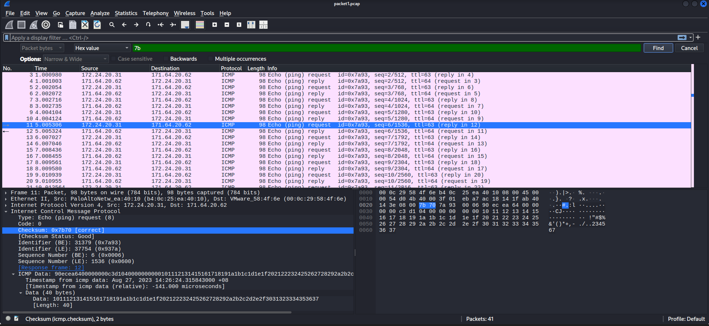
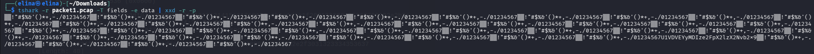
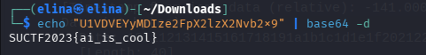

# Chapter 4: Scanning

## QUESTION 1

### Analyse packet1.pcap and find the flag.

> 1. Use the display filter and search for '{' or'7b' and found '7b' in packet 11.

 

> 2. tshark -r packet1.pcap -T fields -e data | xxd -r -p

> Noticed there is an anomalous Base64 string hidden within repetitive noise which is 'U1VDVEyyMDIze2FpX2lzX2Nvb2x9'.

 

> 3. echo "U1VDVEyyMDIze2FpX2lzX2Nvb2x9" | base64 -d

> The Base64 string was successfully decoded, revealing the hidden flag.

 

## QUESTION 2

### Analyse packet2.pcap and find the flag.
